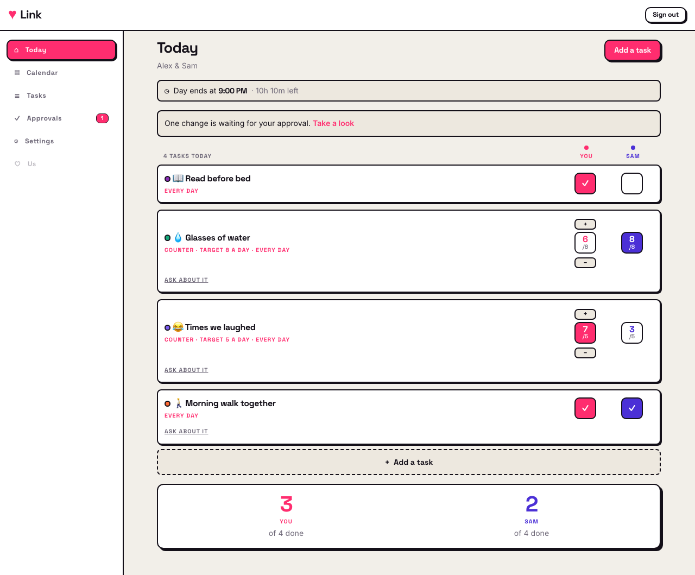

# Link

A web app for couples. Two people link their accounts with a code, keep one shared list
of tasks, and each log their own day — your column next to your partner's.

The full agreed product spec, including what this repo does **not** do yet, is in
[`docs/SPEC.md`](docs/SPEC.md).



## What works today

- Accounts, sign-up and sign-in.
- Linking with a one-time code. The couple's shared **time zone** and **end-of-day time**
  are both agreed during that setup.
- Unlinking, with a 30-day grace period you can undo inside.
- One shared task list with no cap: name, notes, emoji, colour, schedule (every day /
  chosen weekdays / one time), and either a **tick box** or a **counter** with a daily target.
- Partner approval: a new task, an edit, a deletion, or a change to the end-of-day time
  only takes effect once the other partner approves it. Unanswered proposals expire after
  7 days.
- Per-partner completion logging, shown side by side on the day view.
- **The daily competition.** At the agreed time the day closes and whoever did more wins
  it; equal counts are a tie. A shared streak counts days you both cleared.
- **Challenges.** Either of you can question the other's log before the day closes. It only
  asks — nothing is removed unless the person who logged it concedes.
- **The calendar.** Daily winners and ties across a month, and who is taking the month.

The only thing deliberately left undone is the **'Us' tab**, which is a placeholder because
its contents are still an open product decision. See `docs/SPEC.md`.

## Running it locally

You need **Node 20+**, **Docker** (or another container runtime such as
[Colima](https://github.com/abiosoft/colima)) and the
[**Supabase CLI**](https://supabase.com/docs/guides/local-development/cli/getting-started).

```bash
npm install

# Starts Postgres, Auth and the REST API in containers and applies
# supabase/migrations. The first run pulls a few images.
supabase start

# Copy the printed anon key into your own env file.
cp .env.example .env.local
$EDITOR .env.local

npm run dev            # http://localhost:3000
```

`supabase status` reprints the URL and keys at any time. `supabase stop` shuts the stack
down; `npm run db:reset` rebuilds the database from the migrations.

### Environment

Only two values are needed, both public:

| Variable | What it is |
| --- | --- |
| `NEXT_PUBLIC_SUPABASE_URL` | `http://127.0.0.1:54321` for the local stack |
| `NEXT_PUBLIC_SUPABASE_ANON_KEY` | the anon key `supabase start` prints |

**Never commit real keys.** `.env.example` is the only env file in git; every
`.env*.local` is gitignored. This repository is public.

### Trying the two-person flow

Open a second browser profile or a private window, sign up as the other partner there,
then use the code from the first window. One account per browser session.

## Tests

```bash
npm test          # Vitest — approval and expiry, code linking, scheduling, day
                  #          boundaries, scoring, streaks and month tallies
npm run test:db   # SQL — RLS isolation, the approval rules, day settling, challenges
npm run test:e2e  # Playwright — the two-partner happy path and the competition
npm run test:all  # all three
```

`npm run test:db` and `npm run test:e2e` need `supabase start` to be running.
Playwright starts its own Next.js dev server on port 3100.

To refresh the screenshots in `docs/screenshots/`:

```bash
SCREENSHOTS=1 npx playwright test tests/e2e/screenshots.spec.ts
```

## How it is put together

```
src/app/            routes (App Router) and the design tokens
src/components/     shared UI, including the side-by-side board
src/lib/            pure rules (proposals, invite codes, scheduling, day boundaries,
                    scoring), data access, server actions, Supabase clients
supabase/migrations schema, Row Level Security policies, and the rule functions
.github/workflows   the daily maintenance job
tests/unit          Vitest
tests/db            SQL rule checks
tests/e2e           Playwright
```

Two things worth knowing before changing anything:

1. **The database enforces the product rules, not the app.** `tasks` and
   `task_proposals` have no direct write policies. Creating, editing, deleting and
   approving all go through `SECURITY DEFINER` functions, so partner approval cannot be
   skipped by calling the API directly. Add a rule there first, then mirror it in
   `src/lib/` for the UI.
2. **Colours live in `src/app/tokens.css` only.** No component hard-codes one. Rose is
   always you and violet is always your partner, on every screen.
3. **A day rolls over at the couple's agreed end-of-day time, not at midnight.** Never use
   the calendar date for anything a partner logs — use `activeLocalDate()` in TypeScript or
   `couple_active_date()` in SQL.

## Going live

Nothing here is deployed yet. When it is, the Supabase free tier is far more than two
people need — the largest table grows by roughly 2 MB a year against a 500 MB limit. The
one catch is that free projects pause after a week with no activity;
`.github/workflows/maintenance.yml` runs daily and keeps the project awake as a side
effect of doing its real work. It needs two repository secrets, documented at the top of
that file.
